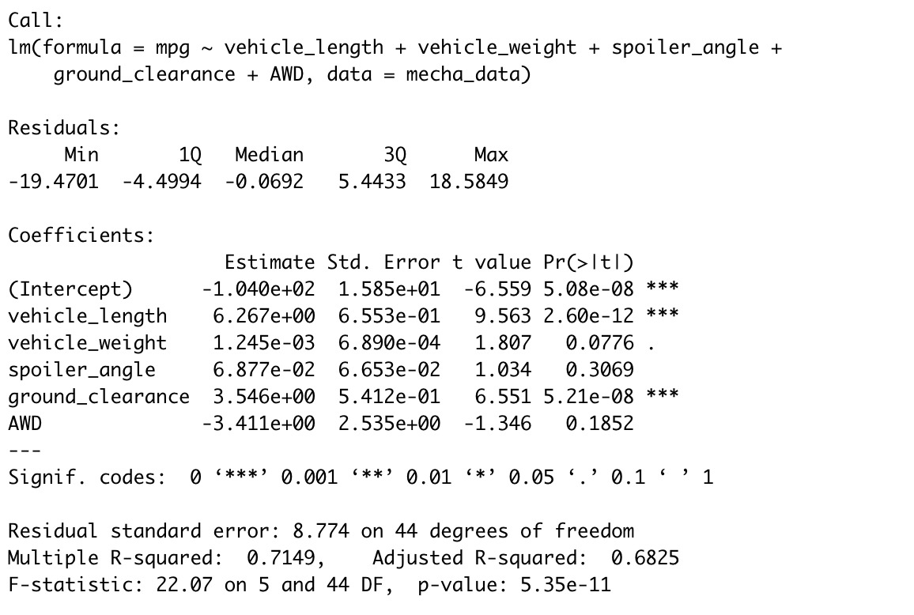
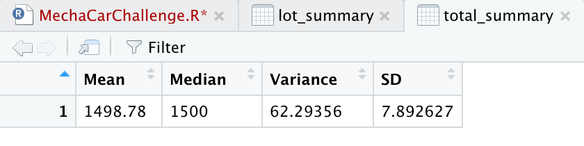
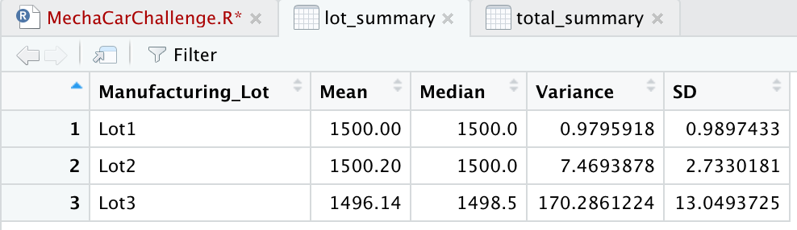

# MechaCar Statistical Analysis

## Linear Regression to Predict MPG

As shown above in our summary statistcs, we found that the vehicle length and ground clearance provided the least non-random amount of variance to the mpg values with p-values far less than .05. Since these values are below our threshold of .05, we can reject the null hypothesis. The slope of our linear model is considered to be not zero because of the p value of 5.35 x 10 ^ -11, and our subsequent rejection of the null hypothesis. Our linear model does predict mpg for the MechaCar prototypes with a 71.5% (r squared value) accuracy. 

## Summary Statistics on Suspension Coils

MechaCar has noted in their design specifications that the variance of the suspension coils cannot exceed more than 100 lbs per sq inch. 

### All Lots

In the table above, we can see that it does meet the design specifications with a variance of 62.3 lbs per sq inch.

### Per Lot

In the table above showing the variance for each lot, it is clear that lot 1 and lot 2 were far lower than the threshold of 100 lbs per sq inch, but lot 3 exceeds the 100 lbs per sq inch limit and does not uphold the specifications.

## T-Tests on Suspension Coils

### All lots

In the table for all lots, our p value is greater than .05 and as a result we fail to reject the null hypothesis that there is a statistical difference from the population mean of 1500.

### Per Lot

Lot 1

Lot 2

Lot 3

In the above tables, lot 1 and lot 2 have p values above .05, meaning that we fail to reject the null hypothesis that there is statistcal significance from the population mean of 1500. In lot 3, the p value is .04 and thus we can reject the null hypothesis and that there is statistical difference in lot 3's PSI from the population mean of 1500.

## Study Design: MechaCar vs Competition

We have designed a future study to compare MechaCar versus other companies for C02 emissions for cars used in cities. Thus the key metric we will need to consider is city fuel efficiency. The null hypothesis is that there is no statistical difference in CO2 emissions for MechaCar used in cities. We would use a t test to determine whether or not there is any statistical differences between the means of the MechaCar lots and the competition's cars. In order to proceed on this study, we need to acquire data on the C02 emissions of competitor's cars, specifically for city use.
